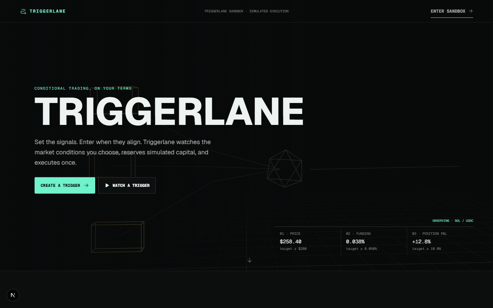
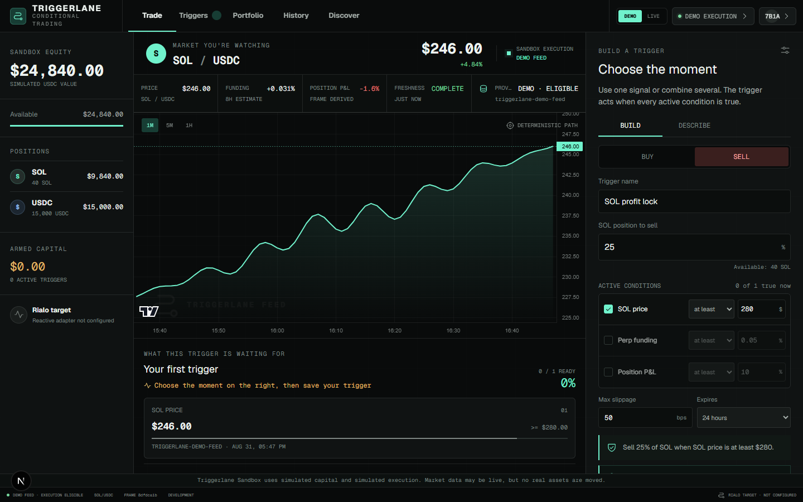
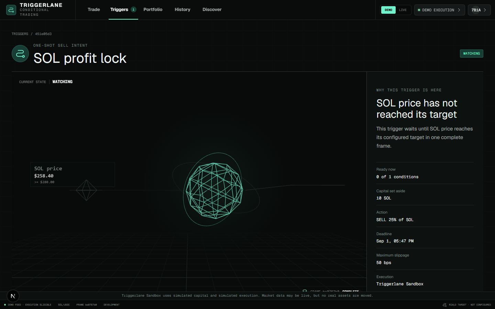

# Triggerlane

**Set the signals. Enter when they align.**

Triggerlane is a conditional trading simulation for building one-shot SOL/USDC orders from complete market states. A trigger can wait for price, funding, position profit, or any supported combination before it reserves virtual capital and executes exactly once.

> [!IMPORTANT]
> Triggerlane currently uses simulated capital and simulated execution. Live market data is monitoring-only. No real assets move, and the Rialo execution target is not configured.



## Why Triggerlane

Traditional limit orders watch one price. Triggerlane lets a trader describe a fuller moment:

- sell when SOL reaches a target and funding is elevated;
- buy only when a selected group of signals agrees;
- use one condition when that is all the strategy needs;
- reserve the intended virtual capital before execution;
- inspect why a trigger is waiting, blocked, filled, cancelled, or expired;
- prove a simulated fill with its source frame, quote, reservation, and ledger receipt.

The current build is intentionally narrow: one market, a small qualified signal set, deterministic simulated settlement, and a visible boundary around everything that is not available.

## Product Tour

| Trade | Trigger detail |
| --- | --- |
|  |  |

### Core experiences

- **Trade:** compose a trigger with one to three active conditions and preview its capital commitment.
- **Triggers:** scan active, paused, draft, and completed intents by readiness, action, capital, and deadline.
- **Trigger detail:** inspect the current condition frame, lifecycle, exact observations, activity, and receipt.
- **Portfolio:** reconcile available and reserved virtual balances against an immutable local ledger.
- **History:** review fills, blocked attempts, cancellations, expirations, and their evidence.
- **Discover:** load supported strategy examples into an editable composer.
- **Replay:** test the same trigger against deterministic 24-hour, 7-day, or 30-day demo history.

## Ninety-Second Demo

1. Open `/trade` in **Demo Feed** mode.
2. Keep the default multi-signal SOL trigger or remove conditions until only the signals you want remain.
3. Save the trigger, then start it. Triggerlane reserves the required simulated capital.
4. Advance the Demo Feed and inspect the waiting reason as conditions become true.
5. Open the trigger detail view to see the complete stored frame and lifecycle.
6. When every active condition agrees on one post-start frame, confirm the single simulated fill.
7. Open History or Portfolio and trace the receipt to its quote, reservation, and ledger entries.
8. Switch to Live Data and confirm that execution controls become unavailable.

The controlled walkthrough is also available in [docs/DEMO_SCRIPT.md](docs/DEMO_SCRIPT.md).

## Execution Boundaries

| Capability | Current behavior |
| --- | --- |
| Market | SOL/USDC only |
| Signals | Price, funding, and position P&L |
| Condition logic | One condition or `ALL` across up to three active conditions |
| Capital | Seeded, simulated SOL and USDC |
| Demo Feed | Deterministic and execution-eligible |
| Live Data | Public Hyperliquid observations, monitoring-only |
| Settlement | Simulated one-shot quote and local ledger receipt |
| AI Composer | Deterministic local parser, not a hosted AI model |
| Accounts | Anonymous local sessions; no production identity system |
| Rialo | Adapter boundary exists; network execution is not configured |

Live observations cannot execute because the selected public provider does not supply the trusted source timestamp and ordering contract required by the engine. Triggerlane never silently changes data provenance. See [Data Providers](docs/DATA_PROVIDERS.md) and the [Rialo Adapter Boundary](docs/RIALO_ADAPTER.md).

## Architecture

```text
Next.js interface
      |
      v
Fastify API + anonymous signed session
      |
      +--> condition compiler and target capability checks
      +--> deterministic frame evaluator
      +--> reservation and one-shot settlement engine
      +--> SSE activity stream and background worker
      |
      v
PGlite persistence
  triggers, observations, reservations, attempts,
  executions, activities, outbox, and double-entry ledger

Execution adapters
  Simulation -> configured and executable with virtual capital
  Rialo   -> explicit NOT_CONFIGURED capability boundary
```

The domain package owns validation, condition evaluation, replay semantics, and the versioned execution intent. The API owns sessions, persistence, provider ingestion, idempotency, reservations, settlement, and receipts. The web application consumes those contracts without moving execution logic into the browser.

## Technology

- TypeScript workspaces
- Next.js and React
- Fastify
- PGlite, a filesystem-backed PostgreSQL-compatible database
- Zod and Decimal.js
- TanStack Query and server-sent events
- Three.js and Lightweight Charts
- Vitest, Playwright, and Axe

## Run Locally

### Requirements

- Node.js 20.9 or newer
- npm
- Google Chrome for the browser test suite

### Start

```bash
npm ci
npm run dev
```

Open [http://127.0.0.1:5173](http://127.0.0.1:5173). The API listens on `http://127.0.0.1:8787`.

No Docker service is required. PGlite stores local state under `.data/`, which is excluded from Git. Development defaults work without an environment file. For explicit configuration, copy `.env.example` and provide the values through your shell or deployment environment. Never deploy with the example session secret.

### Useful commands

```bash
npm test              # domain and API tests
npm run typecheck     # all workspaces
npm run build         # production build
npm run test:e2e      # browser journeys; local app must be running
npm run check:launch  # complete launch gate
```

Health endpoints:

- `GET /health` for API liveness
- `GET /health/ready` for database readiness
- `GET /health/diagnostics` for latency, errors, outbox, execution, and worker health

## Deploy

The MVP deployment target is Railway. Triggerlane runs as one Docker service with a persistent volume mounted at `/data`, preserving same-origin sessions and the continuously running worker. Follow [Deploy Triggerlane to Railway](docs/DEPLOYMENT.md) for the exact service, environment, health-check, persistence, and smoke-test settings.

## Repository Layout

```text
apps/api/       Fastify API, persistence, providers, and execution adapters
apps/web/       Next.js product interface and 3D explanations
packages/domain Shared schemas, evaluator, replay, and compiler contracts
e2e/            Full browser journeys and launch-quality gates
docs/           Provider, adapter, demo, and launch documentation
scripts/        Build-budget checks
```

## Quality Gate

The automated suite covers condition evaluation, idempotent mutations, reservation conflicts, stale and out-of-order data, restart recovery, one-time settlement, ledger integrity, responsive layouts, accessibility, reduced motion, non-WebGL fallbacks, and production bundle budgets.

Read [Launch Audit](docs/LAUNCH_AUDIT.md) for the exact contract.

## Security

Do not use this build with real funds, private keys, exchange credentials, or production trading accounts. To report a vulnerability, follow [SECURITY.md](SECURITY.md) and avoid filing a public issue containing sensitive details.

## License

Triggerlane is available under the [MIT License](LICENSE).
